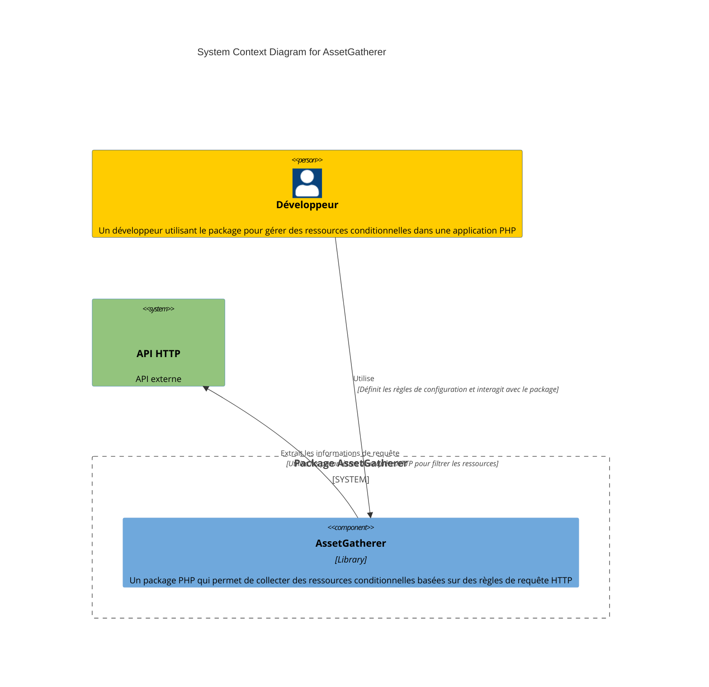
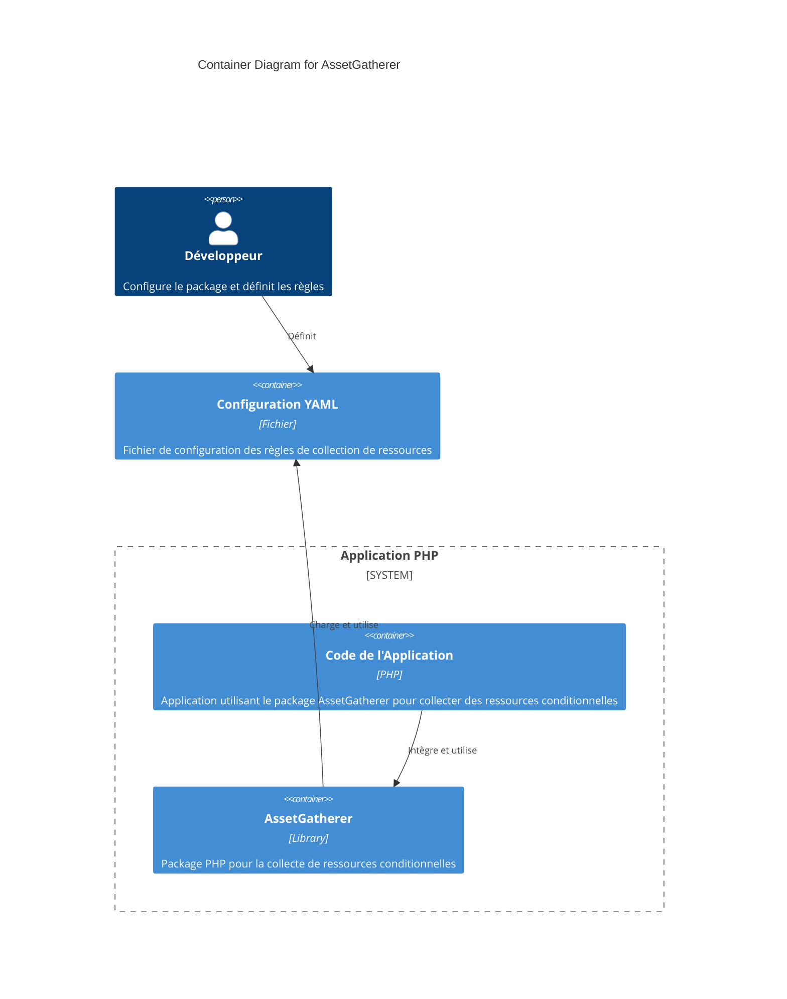
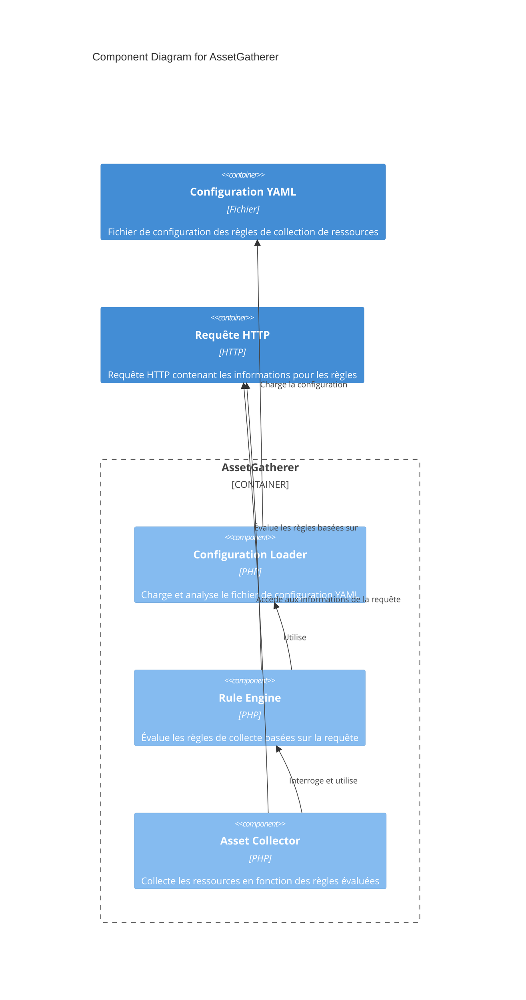

# AssetGatherer Documentation

Le package `AssetGatherer` permet de collecter des ressources (images, CSS, JavaScript, etc.) en fonction de règles définies pour chaque requête HTTP. Ces règles sont configurées dans un fichier YAML. Les ressources sont organisées en groupes appelés _bundles_, qui peuvent regrouper des fichiers de différents types selon les sections de l'application.

## Table des Matières

- [Installation](#installation)
- [Configuration](#configuration)
- [Diagrammes C4](#diagrammes-c4)
  - [Diagramme de Contexte](#diagramme-de-contexte)
  - [Diagramme de Conteneur](#diagramme-de-conteneur)
  - [Diagramme de Composant](#diagramme-de-composant)
- [Utilisation avec PSR-7](#utilisation-avec-psr-7)
- [Utilisation du Dev Container](#utilisation-du-dev-container)
- [Exécution des Tests](#exécution-des-tests)

## Installation

1. **Installer le composant YAML de Symfony** pour pouvoir lire les configurations YAML :

   ```bash
   composer require symfony/yaml
   ```

2. **Installer PHPUnit** pour les tests unitaires :
   ```bash
   composer require --dev phpunit/phpunit
   ```

## Configuration

La configuration du package `AssetGatherer` se fait via un fichier YAML. Chaque _bundle_ peut définir des répertoires et types de fichiers spécifiques, ainsi que des règles conditionnelles en fonction de la requête HTTP (URL, headers, paramètres de requête).

### Structure du Fichier YAML

```yaml
# config/bundles.yaml
homepage:
  images:
    directories: ["path/to/homepage/images"]
    extensions: ["jpg", "png"]
  css:
    directories: ["path/to/homepage/css"]
    extensions: ["css"]
  rules:
    pathContains: "/homepage"

dashboard:
  javascript:
    directories: ["path/to/dashboard/js"]
    extensions: ["js"]
  rules:
    query:
      admin: "true"
```

## Diagrammes C4

### Diagramme de Contexte



### Diagramme de Conteneur



### Diagramme de Composant



## Utilisation avec PSR-7

Le package `AssetGatherer` utilise maintenant PSR-7 pour représenter les requêtes HTTP. Cela permet d'utiliser n'importe quelle implémentation compatible avec PSR-7, comme `nyholm/psr7` ou `guzzlehttp/psr7`.

### Prérequis

Assurez-vous d'avoir une implémentation PSR-7 installée dans votre projet, par exemple :

```bash
composer require nyholm/psr7
```

### Chargement de la Configuration

```php
$assetGatherer = new AssetGatherer();
$assetGatherer->loadConfiguration('config/bundles.yaml');
```

### Création d'une Requête HTTP avec PSR-7

Pour collecter les ressources en fonction d'une requête HTTP, créez une instance de `ServerRequestInterface`.

```php
use Nyholm\Psr7\ServerRequest;

$request = new ServerRequest('GET', '/homepage', [
    'User-Agent' => 'Chrome',
    'Accept' => 'text/html'
]);
```

### Collecte des Ressources

```php
$assetGatherer->gatherAssetsForRequest($request);
```

### Récupération des Ressources Collectées

```php
$allAssets = $assetGatherer->getAssets();
$homepageAssets = $assetGatherer->getAssets('homepage');
```

### Exemple Complet

```php
use AssetGatherer\AssetGatherer;
use Nyholm\Psr7\ServerRequest;

$assetGatherer = new AssetGatherer();
$assetGatherer->loadConfiguration('config/bundles.yaml');

$request = new ServerRequest('GET', '/homepage', [
    'User-Agent' => 'Chrome',
    'Accept' => 'text/html'
]);

$assetGatherer->gatherAssetsForRequest($request);
$assets = $assetGatherer->getAssets();
print_r($assets);
```

## Utilisation du Dev Container

Le projet inclut une configuration de Dev Container pour un environnement de développement reproductible.

### Prérequis

- **Docker** : Assurez-vous que Docker est installé et en cours d'exécution.
- **Visual Studio Code** : Utilisez l'extension "Remote - Containers".

### Démarrage du Dev Container

1. **Ouvrez le projet dans Visual Studio Code**.
2. **Ouvrez le Dev Container** : Appuyez sur `F1`, tapez `Remote-Containers: Reopen in Container`, et sélectionnez cette option.

### Outils et Extensions Disponibles

- **PHP** : Environnement PHP avec la version définie dans le Dockerfile.
- **Composer** : Gestionnaire de dépendances PHP.
- **PHPUnit** : Outil de test.
- **Extensions VS Code** : Intelephense, DocBlocker, Prettier, et Git Graph.

### Exécution des Commandes dans le Dev Container

- **Exécuter les tests PHPUnit** : `phpunit`
- **Installer les dépendances Composer** : `composer install`

## Exécution des Tests

```bash
vendor/bin/phpunit tests/AssetGathererTest.php
```

## Diagrammes C4

### Diagramme de Contexte


### Diagramme de Conteneur


### Diagramme de Composant


## Utilisation du Dev Container

Le projet inclut une configuration de Dev Container pour fournir un environnement de développement reproductible et préconfiguré, idéal pour la collaboration et le développement en environnement isolé. Le Dev Container utilise Docker pour configurer une image avec PHP, Composer, et d'autres dépendances nécessaires pour travailler avec le package `AssetGatherer`.

### Prérequis

- **Docker** : Assurez-vous que Docker est installé et en cours d'exécution.
- **Visual Studio Code** : Utilisez l'extension "Remote - Containers" pour ouvrir et gérer le Dev Container.

### Démarrage du Dev Container

1. **Ouvrez le projet dans Visual Studio Code** : Assurez-vous que le dossier racine du projet est ouvert dans l'éditeur.
2. **Ouvrez le Dev Container** : Appuyez sur `F1`, tapez `Remote-Containers: Reopen in Container`, et sélectionnez cette option. VS Code va alors :
   - Construire l'image Docker définie dans `.devcontainer/Dockerfile`.
   - Démarrer le conteneur avec les outils et extensions configurés.
3. **Installez les dépendances** : Une fois le Dev Container démarré, les dépendances sont installées automatiquement via le `postCreateCommand` défini dans `.devcontainer/devcontainer.json`.

### Outils et Extensions Disponibles

Dans le Dev Container, les outils suivants sont préinstallés :

- **PHP** : Environnement PHP avec la version définie dans le Dockerfile.
- **Composer** : Gestionnaire de dépendances PHP.
- **PHPUnit** : Outil de test pour exécuter des tests unitaires.

### Exécution des Commandes dans le Dev Container

Une fois le Dev Container démarré, vous pouvez utiliser le terminal intégré de VS Code pour exécuter des commandes :

- **Exécuter les tests PHPUnit** : `phpunit`
- **Installer les dépendances Composer** : `composer install`

### Personnalisation

La configuration du Dev Container peut être personnalisée dans les fichiers `.devcontainer/devcontainer.json` et `.devcontainer/Dockerfile`. Par exemple, vous pouvez ajouter des dépendances supplémentaires, configurer des scripts supplémentaires dans `postCreateCommand`, ou installer d'autres extensions Visual Studio Code.

### Avantages du Dev Container

- **Environnement Reproductible** : Les configurations, dépendances, et outils sont identiques pour tous les développeurs travaillant sur le projet.
- **Isolation** : Le Dev Container fonctionne de manière isolée, ce qui évite les conflits de dépendances avec le système local.
- **Facilité de Configuration** : Tout est défini dans le projet, donc aucune configuration manuelle supplémentaire n'est nécessaire pour les nouveaux contributeurs.

Pour plus de détails sur les Dev Containers, consultez la [documentation officielle de Visual Studio Code](https://code.visualstudio.com/docs/remote/containers).
