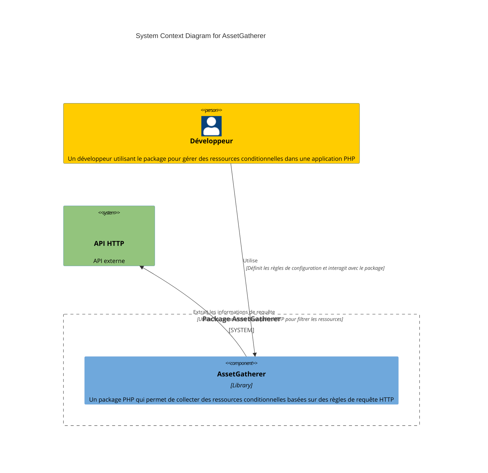
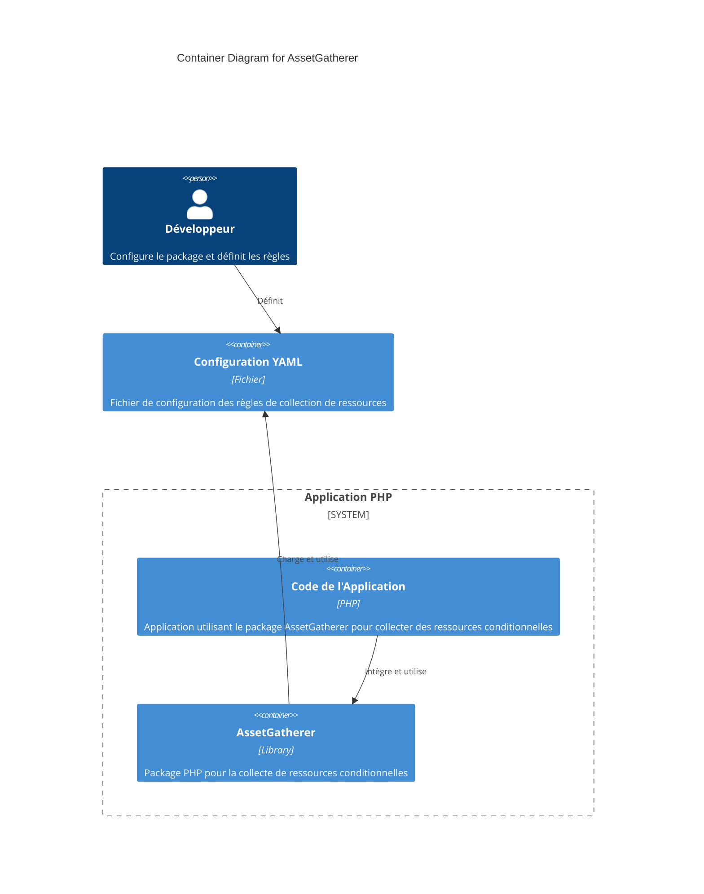
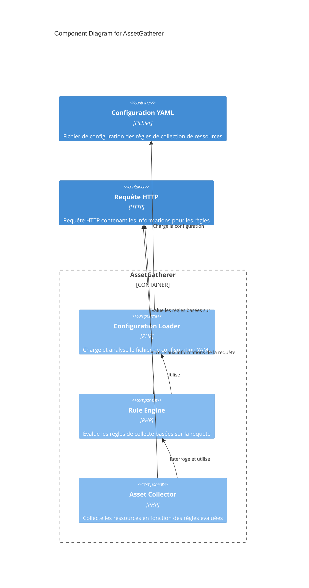

# AssetGatherer Documentation

Le package `AssetGatherer` permet de collecter des ressources (images, CSS, JavaScript, etc.) en fonction de règles définies pour chaque requête HTTP. Ces règles sont configurées dans un fichier YAML. Les ressources sont organisées en groupes appelés _bundles_, qui peuvent regrouper des fichiers de différents types selon les sections de l'application.

## Table des Matières

- [Installation](#installation)
- [Configuration](#configuration)
- [Diagrammes C4](#diagrammes-c4)
  - [Diagramme de Contexte](#diagramme-de-contexte)
  - [Diagramme de Conteneur](#diagramme-de-conteneur)
  - [Diagramme de Composant](#diagramme-de-composant)
- [Utilisation avec PSR-7](#utilisation-avec-psr-7)
- [Utilisation avec Répertoire de Base](#utilisation-avec-répertoire-de-base)
- [Utilisation du Dev Container](#utilisation-du-dev-container)
- [Exécution des Tests](#exécution-des-tests)

## Installation

1. **Installer le composant YAML de Symfony** pour pouvoir lire les configurations YAML :

   ```bash
   composer require symfony/yaml
   ```

2. **Installer PHPUnit** pour les tests unitaires :
   ```bash
   composer require --dev phpunit/phpunit
   ```

## Configuration

La configuration du package `AssetGatherer` se fait via un fichier YAML. Chaque _bundle_ peut définir des répertoires et types de fichiers spécifiques, ainsi que des règles conditionnelles en fonction de la requête HTTP (URL, headers, paramètres de requête).

### Structure du Fichier YAML

```yaml
# config/bundles.yaml
homepage:
  images:
    directories: ["homepage/images"]
    extensions: ["jpg", "png"]
  css:
    directories: ["homepage/css"]
    extensions: ["css"]
  rules:
    pathContains: "/homepage"

dashboard:
  javascript:
    directories: ["dashboard/js"]
    extensions: ["js"]
  rules:
    query:
      admin: "true"
```

## Diagrammes C4

### Diagramme de Contexte



### Diagramme de Conteneur



### Diagramme de Composant



## Utilisation avec Répertoire de Base

Le package `AssetGatherer` prend en charge un répertoire de base pour les _bundles_. En définissant un répertoire de base, tous les chemins spécifiés dans la configuration YAML sont interprétés comme étant relatifs à ce répertoire.

### Exemple d’Utilisation avec Répertoire de Base

```php
use AssetGatherer\AssetGatherer;
use Nyholm\Psr7\ServerRequest;

// Définissez un répertoire de base pour les fichiers d'assets
$baseDirectory = '/var/www/assets';
$assetGatherer = new AssetGatherer($baseDirectory);
$assetGatherer->loadConfiguration('config/bundles.yaml');

// Créez une requête HTTP PSR-7
$request = new ServerRequest('GET', '/homepage', [
    'User-Agent' => 'Chrome',
    'Accept' => 'text/html'
]);

// Collectez les ressources en fonction de la requête
$assetGatherer->gatherAssetsForRequest($request);

// Récupérez et affichez les ressources collectées
$assets = $assetGatherer->getAssets();
print_r($assets);
```

Dans cet exemple :

- **Répertoire de Base** : Le répertoire de base `/var/www/assets` est utilisé pour préfixer tous les chemins des répertoires définis dans `bundles.yaml`.
- **Collecte des Ressources** : Le package cherchera les fichiers dans les répertoires définis dans `bundles.yaml`, relatifs au répertoire de base.

## Utilisation avec PSR-7

Le package `AssetGatherer` utilise maintenant PSR-7 pour représenter les requêtes HTTP. Cela permet d'utiliser n'importe quelle implémentation compatible avec PSR-7, comme `nyholm/psr7` ou `guzzlehttp/psr7`.

### Prérequis

Assurez-vous d'avoir une implémentation PSR-7 installée dans votre projet, par exemple :

```bash
composer require nyholm/psr7
```

### Création d'une Requête HTTP avec PSR-7

```php
use Nyholm\Psr7\ServerRequest;

$request = new ServerRequest('GET', '/homepage', [
    'User-Agent' => 'Chrome',
    'Accept' => 'text/html'
]);
```

## Utilisation du Dev Container

Le projet inclut une configuration de Dev Container pour un environnement de développement reproductible.

### Avant de commencer

- **Docker** : Assurez-vous que Docker est installé et en cours d'exécution.
- **Visual Studio Code** : Utilisez l'extension "Remote - Containers".

### Démarrage du Dev Container

1. **Ouvrez le projet dans Visual Studio Code**.
2. **Ouvrez le Dev Container** : Appuyez sur `F1`, tapez `Remote-Containers: Reopen in Container`, et sélectionnez cette option.

## Exécution des Tests

```bash
vendor/bin/phpunit tests/AssetGathererTest.php
```

---

Cette documentation couvre l'installation, la configuration, l'utilisation, et les tests du package `AssetGatherer`.
